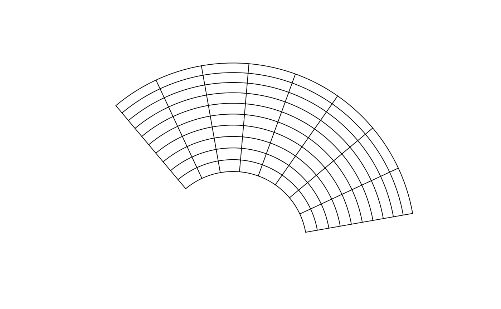
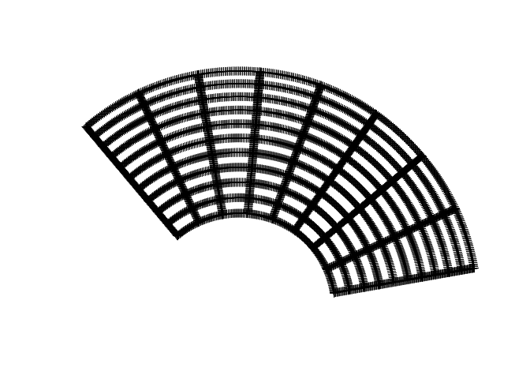
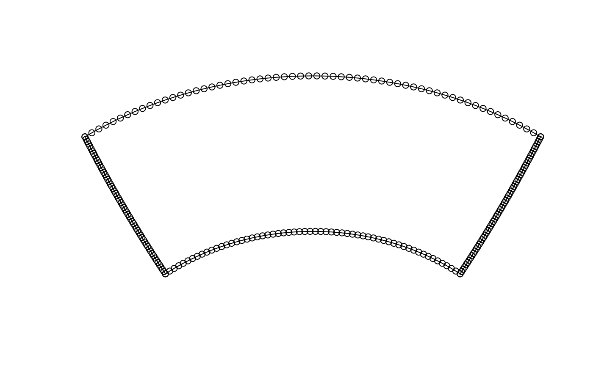

<!-- README.md is generated from README.Rmd. Please edit that file -->

# graticule

<!-- badges: start -->

[](https://travis-ci.org/mdsumner/graticule)
[](https://ci.appveyor.com/project/mdsumner/graticule)
[](https://codecov.io/gh/mdsumner/graticule?branch=master)
[](https://cran.r-project.org/package=graticule)
[](https://cran.r-project.org/package=graticule)
<!-- badges: end -->

Graticules are the longitude latitude lines shown on a projected map,
and defining and drawing these lines is not easy to automate. The
graticule package provides the tools to create and draw these lines by
explicit specification by the user. This provides a good compromise
between high-level automation and the flexibility to drive the low level
details as needed, using base graphics in R.

## Installation

You can install the released version of graticule from
[CRAN](https://CRAN.R-project.org) with:

``` r
install.packages("graticule")
```

And the development version from [GitHub](https://github.com/) with:

``` r
# install.packages("devtools")
devtools::install_github("mdsumner/graticule")
```

## Example

This is a basic example which shows how to create a graticule at
specific longitude and latitude spacings and in a given projection.

``` r
library(graticule)
#> Loading required package: sp
grat <- graticule(lons = seq(100, 220, by = 15), lats = seq(-60, -10, by = 5), proj = "+proj=laea +lon_0=140 +lat_0=-90 +datum=WGS84")
plot(grat)
```



There is an automatic segmentation that is done at equal distances along
these [rhumb lines](https://en.wikipedia.org/wiki/Rhumb_line). This is
not an *[ideal spacing](https://bost.ocks.org/mike/example/)* but is an
improvement on the common alternatives, and is easier to work with when
you need fine control.

If your projection is not wildly warped in most areas then the default
rhumb line segmentation is the best first step.

``` r
plot(as(grat, "SpatialPoints"))
```



This also allows the common case of creating a sensible single polygon
*wedge*, i.e. 

``` r
wedge <- graticule(lons = c(-40, 40), lats = c(-60, -40), proj = "+proj=laea +lat_0=-50 +lon_0=0 +x_0=0 +y_0=0 +datum=WGS84 +units=m +no_defs")
plot(wedge)
points(as(wedge, "SpatialPoints"))
```

 \#\# Known
Issues

Please feel free to share your experiences and report problems at
<https://github.com/mdsumner/graticule/issues>

-   general problems with segmentation, this is not done smartly yet
-   There’s work needed for when `graticule_labels()` are created
    without using `xline/yline`, need more careful separation between
    generating every combination in the grid versus single lines

------------------------------------------------------------------------

Please note that the ‘graticule’ project is released with a [Contributor
Code of
Conduct](https://github.com/mdsumner/graticule/blob/master/CODE_OF_CONDUCT.md).
By contributing to this project, you agree to abide by its terms.
