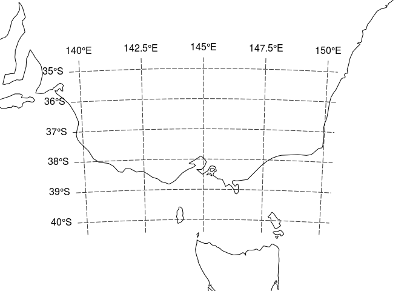

<!-- README.md is generated from README.Rmd. Please edit that file -->
Graticules for R
================

Graticules are the longitude latitude lines shown on a projected map, and defining and drawing these lines is not easy to automate. The **graticule** package provides the flexibiility to create and draw these lines by explicit specification by the user.

A simple example uses data from **rworldmap**.

``` r
library(rgdal)
library(raster)
library(rworldmap)
data(countriesLow)
library(graticule)
map<- subset(countriesLow, SOVEREIGNT == "Australia")

## VicGrid
prj <- "+proj=lcc +lat_1=-36 +lat_2=-38 +lat_0=-37 +lon_0=145 +x_0=2500000 +y_0=2500000 +ellps=GRS80 +towgs84=0,0,0,0,0,0,0 +units=m +no_defs"

pmap <- spTransform(map, CRS(prj))

## specify exactly where we want meridians and parallels
lons <- seq(140, 150, length = 5)
lats <- seq(-40, -35, length = 6)
## optionally, specify the extents of the meridians and parallels
## here we push them out a little on each side
xl <-  range(lons) + c(-0.4, 0.4)
yl <- range(lats) + c(-0.4, 0.4)
## build the lines with our precise locations and ranges
grat <- graticule(lons, lats, proj = prj, xlim = xl, ylim = yl)
## build the labels, here they sit exactly on the western and northern extent
## of our line ranges
labs <- graticule_labels(lons, lats, xline = min(xl), yline = max(yl), proj = prj)

## set up a map extent and plot
op <- par(mar = rep(0, 4))
plot(extent(grat) + c(4, 2) * 1e5, asp = 1, type = "n", axes = FALSE, xlab = "", ylab = "")
plot(pmap, add = TRUE)
## the lines are a SpatialLinesDataFrame
plot(grat, add = TRUE, lty = 5, col = rgb(0, 0, 0, 0.8))
## the labels are a SpatialPointsDataFrame, and islon tells us which kind
text(subset(labs, labs$islon), lab = parse(text = labs$lab[labs$islon]), pos = 3)
text(subset(labs, !labs$islon), lab = parse(text = labs$lab[!labs$islon]), pos = 2)
```



``` r

par(op)
```

Comparison to to tools in **sp** and **rgdal**
----------------------------------------------

The **rgdal** function *llgridlines* will draw a graticule on a map but has a few limitations.

-   no control over the exact meridian and parallel lines to draw
-   the extent of lines is not independent of their perpendicular counterparts
-   relies on a projected object with sufficient verticular density.

Many of these limitations can be worked around, especially by leveraging tools in the **raster** package but it's not particularly elegant.

Comparison to **mapGrid** in **oce**
------------------------------------

This is good, have not explored in detail yet . . .
